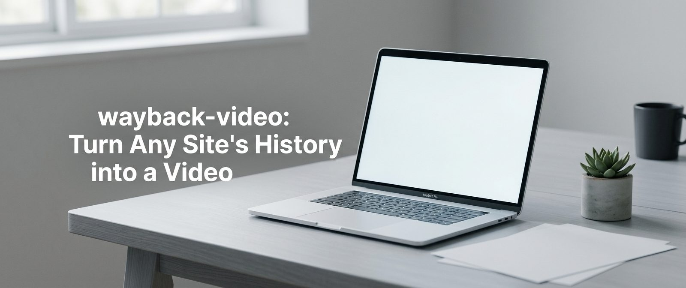

# wayback-video: Turn Any Site's History into a Video

I have a habit of Googling old websites just to see what they looked like. Clicking through the Wayback Machine one snapshot at a time never gives you the full picture. So I built a CLI tool that does it automatically - one command, years of history, one MP4.

Playwright renders each archived snapshot, perceptual hashing merges identical-looking years into single labeled clips, and ffmpeg assembles the final video.

## What's Inside

- How the 4-phase pipeline works: CDX fetch, period sampling, Playwright render, ffmpeg assembly
- Why Service Workers break archived SPAs and how the tool blocks them before page load
- Two-pass deduplication: SHA-256 exact dedup + perceptual hash for consecutive similar frames
- Five rendering modes: default, scroll, hybrid, Wayback PNGs only, image evolution
- `--scroll` mode details: full-page pan animation with auto-calculated scroll speed

## 📎 Read Full

[wayback-video: Turn Any Site's History into a Video](https://dev.to/tegos/PLACEHOLDER)
